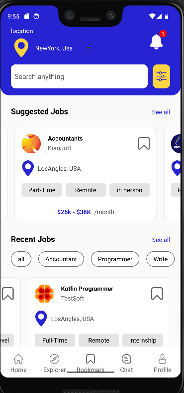
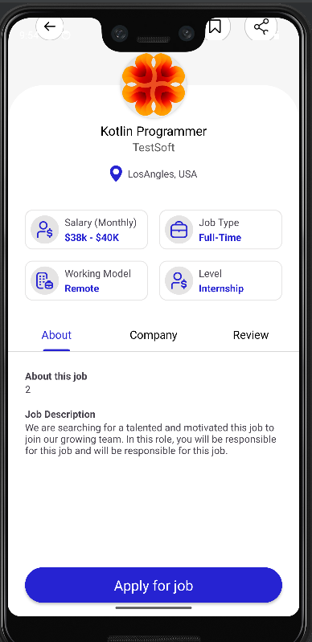

Job Application App

This project is an Android job application app developed using Kotlin and the MVVM (Model-View-ViewModel) architecture. The app demonstrates modern Android development practices and provides a clean, sustainable, and scalable codebase.

Features

Browse job listings
View job details
Apply for jobs
Save favorite jobs
Technologies Used

Kotlin: Primary programming language

MVVM Architecture: For separation of concerns and a more manageable, testable codebase
LiveData: To observe data changes and update the UI
ViewModel: To store and manage UI-related data in a lifecycle-conscious way

Screenshots

 

